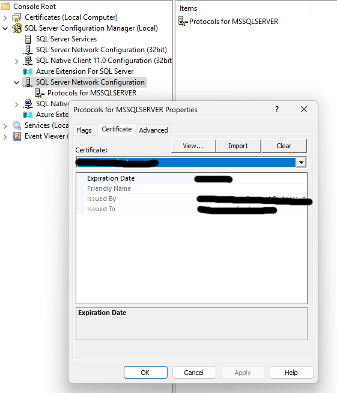
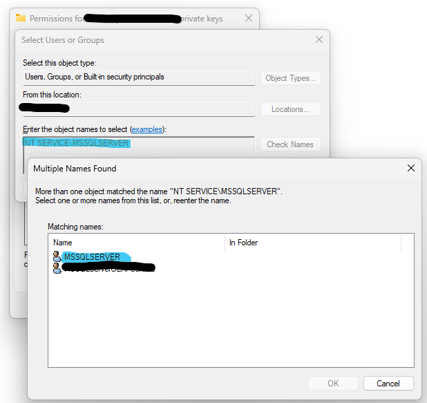

# Setting up SQL Server Service Broker (SSB)

SQL Server Version:^1^ 

Use of Service Broker is best when two systems do not share a common authentication source like NTLM.  Certificates are used to deliver messages with transport security (validates it came from an authorized source) and dialog security (the message's data encryption).

## Required Components Setup

### Import Certificate with Private Key to Repository SQL Server

- [ ] Import Certificate: Local Computer -> Personal (My)



- [ ] Context Menu on Certificate -> All Tasks -> Manage Private Keys



- [ ] Add Read permission for SQL Service Principle (e.g. NT SERVICE\MSSQLSERVER) 

> [!IMPORTANT]
> Remember to Restart SQL Server Service

### Certificate Repository
> [!NOTE]
> This for this example, as long the cert follows the guidance by Microsoft it should work.
> Create them in a seperate DB and export them (Backup Certificate ....), including the private key (pvk)

#### DB generated Certificates
- [ ] Create Key Repository from DB Script Path^2^
- [ ] Create Certificates in Repository DB
- [ ] Backup Certificates

#### CA generated Certificates 
- Use PvkConverter to create CER and PVK files from CA generated PFX

- [ ] Convert PFX to CER and PVK files
- [ ] Import with CREATE CERTIFICATE...


### Service Broker Databases
- A - Source system 
- B - Receiving system

#### Initial Setup Run 1
1. User DB Certificate password of local system certificate (dialog)
1. Certificate path of certificates
1. Generate Routes is False
1. Local Service Name, each service with have a unique name - this example has one for send and receive for one use case.  Many use cases can exist
1. Master DB Certificate Password of local system certificate (transport)
1. Remote Broker ID - empty string
1. Remote Service Address - empty string
1. Remote Service Name, each named for the receiving end of the service
1. Remote Service Broker Database name

#### Initial Setup Run 2
1. User DB Certificate password of local system certificate (dialog)
1. Certificate path of certificates
1. Generate Routes is True
1. Local Service Name, each service with have a unique name - this example has one for send and receive for one use case.  Many use cases can exist
1. Master DB Certificate Password of local system certificate (transport)
1. Remote Broker ID - Guid of remote system [ DB Properties -> Options -> Broker ID]
1. Remote Service Address - FQDN of Remote system
1. Remote Service Name, each named for the receiving end of the service
1. Remote Service Broker Database name

## Sending Data
> [!NOTE]
> This is the payload sample for the validating message types for this example.
```
 <payloads>
   <payload>
	 <id>1</id>
	 <content>some content</content>
   </payload>
   ...
 </payloads>
```
> [!NOTE]
> This is the error sample for the application errors messages for this example.
```
<errors>
   <error>
	 <id>1</id>
	 <errorId>2900</errorId>
	 <errorDescription>Error Message</errorDescription>
   </error>
   ...
 </errors>
```

- Table-valued parameter [spec](https://learn.microsoft.com/en-us/dotnet/framework/data/adonet/sql/table-valued-parameters) from C# 
- Passing a table-valued to a stored procedure backed by service broker
- Kicks off a Send Method to send to a Remote Broker (or a different one on local)  
- The Send Method Arguments can have an xml payload validated by a schema, extracted strings (either xml, json, encoded binaries from VARBINARY), or data that the BROKER DB leave as unvalidated

### Security Model
-	I used Certificates to allow two disparate systems to function together
	- Bonus here is the two systems do not need the same backbone authentication (Active Directory, LDAP, etc.)

- Service Broker Routes operate with FQDNs only.  Add Server A and Server B to an internal DNS


### External Activator Setup
> [!IMPORTANT]
This needs to be setup only if only if running the external activator example
```
USE Master
GO

CREATE LOGIN [SSBEA_Service] FROM WINDOWS -- Or whatever the service name was created when setting up External Activator Service
GO

USE ServiceBrokerC -- Or the name of the server performing the notifcation processes
GO

CREATE USER [SSBEA] FOR LOGIN [SSBEA_Service] -- Or the name user to map to the your login 
GO

GRANT CONNECT TO [SSBEA]
GO

GRANT RECEIVE ON [NotificationQueueC]
GO

GRANT VIEW DEFINITION ON SERVICE::NotificationServiceC TO [SSBEA]
GO

GRANT REFERENCES ON SCHEMA::dbo TO [SSBEA]
GO
```

^1^ Microsoft SQL Server 2022 (RTM-GDR) (KB5046057) - 16.0.1130.5 (X64)   Sep 25 2024 11:10:10   Copyright (C) 2022 Microsoft Corporation  Developer Edition (64-bit) on Windows 10 Pro 10.0 <X64> (Build 22631: ) (Hypervisor)

^2^ Solution dir/Key Repository/